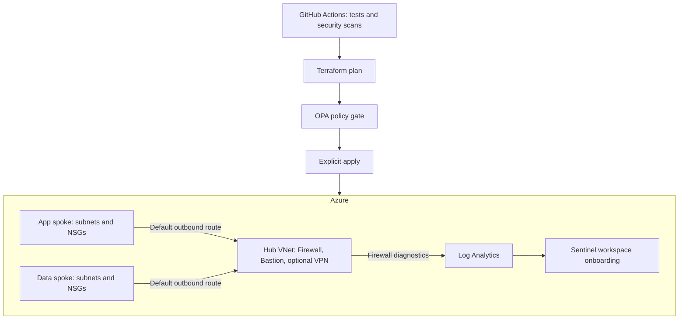

# Azure Secure Landing Zone

[](https://github.com/mohamed-abdelhedi/azure-secure-landing-zone/actions/workflows/security-scan.yml)
[](LICENSE)

A Terraform reference implementation of Azure hub-and-spoke networking, centralized firewall inspection, and Microsoft Sentinel onboarding. Built to demonstrate cloud security engineering with reproducible tests and policy checks.

**Terraform · Azure · Microsoft Sentinel · OPA · GitHub Actions**

[Architecture](ARCHITECTURE.md) · [Local validation](#validate-without-an-azure-account) · [Deployment](#deploy-to-your-own-azure-subscription) · [Security model](SECURITY.md)

## What this project implements

- A hub VNet and two peered spoke VNets, with workload subnets, NSGs, and default outbound routes through Azure Firewall.
- Azure Firewall with a policy, threat intelligence in Deny mode, and Premium IDPS in Deny mode for the production configuration.
- Azure Bastion with its required NSG rules; an optional VPN gateway with BGP.
- Log Analytics, Sentinel workspace onboarding, an email action group, and Firewall diagnostic logs and metrics sent to the workspace.
- OPA policies that evaluate Terraform plan JSON for required tags, permitted regions, private storage settings, and Premium IDPS.
- Credential-free Terraform mock tests, policy regression tests, and blocking Checkov and Trivy scans.

This is a tested reference configuration, not a certified or fully deployed enterprise landing zone. Azure deployment, connectivity, log delivery, and workload behavior still need validation in your subscription.

## Architecture



The app and data subnet names reserve space for future workloads. **AKS, Application Gateway/WAF, SQL, Cosmos DB, private endpoints, ExpressRoute, TLS inspection, Sentinel detection rules, and SOAR playbooks are not deployed.** Existing PNG diagrams in `docs/diagrams` are earlier design concepts, not the implemented resource inventory.

| Configuration | Development | Production |
| :--- | :--- | :--- |
| Firewall | Standard | Premium, IDPS Deny |
| Threat intelligence | Deny | Deny |
| Bastion | Standard + NSG | Standard + NSG |
| VPN gateway | Disabled | VpnGw2, BGP enabled |
| Log retention | 30 days | 90 days |
| Terraform state | Separate dev key | Separate prod key |

Default address ranges are `10.0.0.0/16` (hub), `10.1.0.0/16` (app), and `10.2.0.0/16` (data). Dev and prod reuse these ranges and must remain isolated; redesign addressing before connecting them.

## Repository layout

| Directory | Purpose |
| :--- | :--- |
| `environments/dev`, `environments/prod` | Root configurations, backend examples, mock tests and provider locks |
| `modules/network-hub` | Firewall, Bastion, VPN and hub tests |
| `modules/network-spoke` | Subnets, NSGs, peerings and default routes |
| `modules/monitoring` | Workspace, Sentinel onboarding and action group |
| `policies` | Rego v1 policies and regression tests |
| `scripts` | Cross-platform deployment and plan-policy checks |
| `tests` | Policy CLI failure-path tests |

## Validate without an Azure account

Install Terraform **1.16.2**, OPA **1.20.2**, and Node.js **22** to match CI. The provider remains on AzureRM **3.117.1**; upgrading to 4.x is a separate migration.

From the repository root:

```sh
terraform fmt -check -recursive
terraform -chdir=environments/dev init -backend=false -input=false -lockfile=readonly
terraform -chdir=environments/dev validate
terraform -chdir=environments/dev test
terraform -chdir=environments/prod init -backend=false -input=false -lockfile=readonly
terraform -chdir=environments/prod validate
terraform -chdir=environments/prod test
terraform -chdir=modules/network-hub init -backend=false -input=false -lockfile=readonly
terraform -chdir=modules/network-hub test
opa check --strict policies/
opa test policies/ -v
node --test tests/policy-cli.test.mjs
node scripts/test-plans.mjs environments/dev
node scripts/test-plans.mjs environments/prod
node scripts/test-plans.mjs modules/network-hub
```

These tests use a mocked Azure provider and never create Azure resources. The test-plans script also feeds the generated resource plans into OPA. Provider/plugin downloads still require internet access.

Security scans used in CI:

```sh
python -m pip install checkov==3.3.16
checkov -d . --framework terraform --compact
trivy config . --severity HIGH,CRITICAL --exit-code 1
```

CI pins Trivy to **0.74.0**. Checkov failures and high/critical Trivy findings block the workflow. Dependencies and actions are pinned for reproducibility; Dependabot proposes updates.

## Deploy to your own Azure subscription

Azure Firewall, Bastion, VPN and log ingestion incur charges. Review the plan and Azure pricing before applying. Nothing in the pull-request or push workflow deploys infrastructure.

1. Authenticate with `az login` and select your subscription. Use an identity with the required resource permissions and **Storage Blob Data Contributor** on the state backend.
2. Use an existing secured state backend, or run `scripts/init-backend.sh` / `scripts/init-backend.ps1`. The helpers create Azure resources, require existing blob-data permissions, and use Entra authentication instead of retrieving storage keys.
3. Copy `environments/dev/backend.hcl.example` to `backend.hcl` in the same directory and fill in your backend details. Copy `terraform.tfvars.example` to `terraform.tfvars` and set your region, ownership tags and real alert address. Repeat for prod when needed. Local values and plans are gitignored.
4. If switching from offline validation to a real backend for the first time, run `terraform -chdir=environments/dev init -reconfigure -backend-config=backend.hcl`. For an existing deployment, migrate existing state deliberately instead of initializing an empty state.
5. Plan through the helper:

```sh
node scripts/deploy.mjs dev plan
node scripts/deploy.mjs dev apply
```

Equivalent wrappers: `bash scripts/deploy.sh dev plan` or `.\scripts\deploy.ps1 -Environment dev -Action plan` in PowerShell. The helper regenerates a plan, checks it with OPA, and requires an explicit typed confirmation before applying. It stops on command failures and removes temporary JSON plans. `destroy` uses the same flow with a destroy plan.

To evaluate an independently generated plan:

```sh
terraform -chdir=environments/dev show -json tfplan > plan.json
node scripts/check-plan.mjs plan.json
```

Plan JSON can contain secrets. Keep it local and delete it after use; the workflows do not upload plan artifacts.

### GitHub Actions deployment

The manual **Terraform Plan or Apply** workflow runs only from `main` and defaults to **plan**. It runs all quality gates before obtaining Azure credentials.

Configure a GitHub environment named `dev` or `prod` and an Azure federated identity with subject `repo:mohamed-abdelhedi/azure-secure-landing-zone:environment:dev` (or `:prod`). Follow [GitHub's Azure OIDC setup](https://docs.github.com/en/actions/how-tos/secure-your-work/security-harden-deployments/oidc-in-azure). No client secret is required.

Set these **environment variables** in GitHub: `AZURE_CLIENT_ID`, `AZURE_TENANT_ID`, `AZURE_SUBSCRIPTION_ID`, `BACKEND_RESOURCE_GROUP`, `BACKEND_STORAGE_ACCOUNT`, `BACKEND_CONTAINER`, and `ALERT_EMAIL`.

Production apply also requires an environment reviewer rule; the workflow refuses to apply if it cannot verify that rule. Configure branch restrictions and reviewers appropriate to your deployment. OIDC trust and environment protection must be configured in your own accounts; the repository does not create that access.

## Next improvements

- Validate a real dev deployment, capture connectivity and log-ingestion evidence, and add a destroy/recovery runbook.
- Add explicit workload isolation rules and Private Link/DNS with tests before adding applications or databases.
- Add Sentinel analytics rules with sample events and tested incident workflows.
- Introduce cost budgets and a deliberate AzureRM 4.x migration.

## Author and license

[Mohamed Abdelhedi](https://github.com/mohamed-abdelhedi) · [MIT License](LICENSE)
