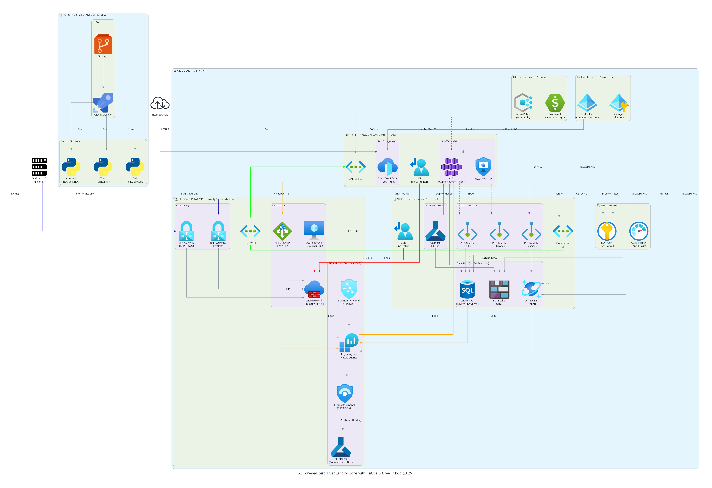
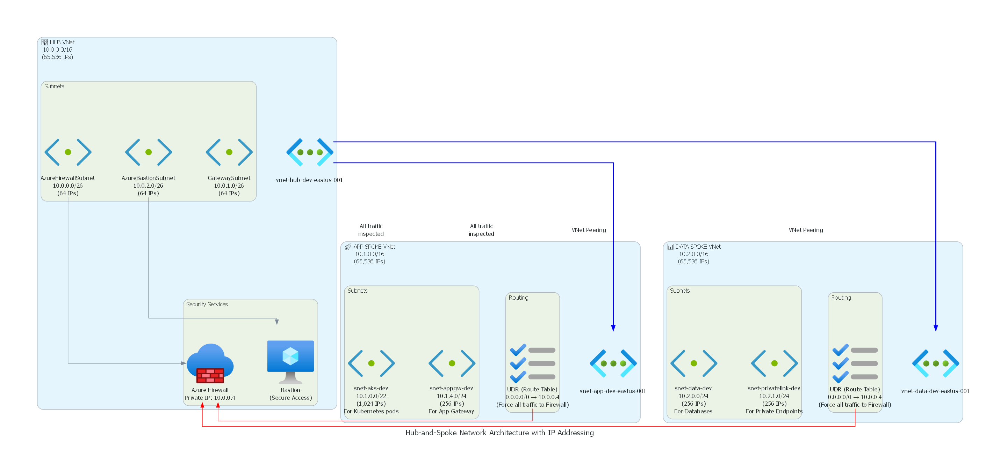

<div align="center">

# 🛡️ Azure Enterprise Zero Trust Landing Zone
### Production-Grade Infrastructure as Code (Terraform) with FinOps & DevSecOps

[](https://www.terraform.io/)
[](https://azure.microsoft.com/)
[](https://github.com/features/actions)
[](https://www.checkov.io/)
[](https://trivy.dev/)
[](https://www.openpolicyagent.org/)
[](LICENSE)

<br/>

**A production-ready, enterprise-scale cloud architecture implementing the Azure Cloud Adoption Framework (CAF), Zero Trust Network Architecture, Shift-Left DevSecOps, and FinOps cost governance.**

[Architecture Overview](#-architecture-overview) •
[Network Topography](#-network-topology--ip-scheme) •
[Security & DevSecOps](#-shift-left-devsecops--governance) •
[Multi-Environment](#-multi-environment-matrix) •
[Quick Start](#-quick-start-guide) •
[Deep Dive Guide](ARCHITECTURE.md)

</div>

---

## 📸 Architecture Visualizations

### High-Level Cloud Architecture
The architecture is structured around a centralized **Hub-and-Spoke topology**, enforcing perimeter inspection, micro-segmentation, private data endpoints, and automated SIEM threat detection.

<div align="center">
  
</div>

---

## 🌟 Core Architectural Pillars

- 🔒 **Zero Trust Network Architecture**:
  - Centralized **Azure Firewall Premium** with IDPS (Intrusion Detection and Prevention) & TLS Inspection.
  - Forced tunneling (`0.0.0.0/0`) on all spokes routing through the Hub Firewall.
  - Zero public IP exposure for data tier resources via **Azure Private Link** and **Private Endpoints**.
  - **Azure Bastion** for credential-less, encrypted RDP/SSH administrative access.
- 🚀 **Cloud-Native & Hybrid Connectivity**:
  - **App Spoke (`10.1.0.0/16`)**: Dedicated subnets for Azure Kubernetes Service (AKS) with Calico network policies and Application Gateway WAF v2.
  - **Data Spoke (`10.2.0.0/16`)**: Hardened subnets for Azure SQL, Cosmos DB, and Data Lake Gen2 storage.
  - **Hybrid Integration**: Virtual Network Gateway supporting Site-to-Site VPN and ExpressRoute with dynamic BGP routing.
- 🛡️ **Shift-Left DevSecOps**:
  - Automated CI/CD quality gates verifying code formatting (`terraform fmt`), syntax validation, and policy compliance.
  - Static security analysis with **Checkov** (750+ IaC rules) and **Trivy** vulnerability scanning.
  - Guardrail enforcement with **Open Policy Agent (OPA)** Rego policies before deployment.
- 🤖 **AI-Driven SIEM / SOAR**:
  - Unified logging via **Log Analytics Workspace**.
  - Threat detection, automated hunting, and incident response playbooks powered by **Microsoft Sentinel**.
- 💰 **FinOps & Cost Governance**:
  - Strict tagging policies enforced at the IaC and policy level (Environment, Owner, CostCenter, Project).
  - Environment-specific SKU sizing (cost-efficient Standard tier in `dev`, high-availability Premium with IDPS in `prod`).

---

## 🌐 Network Topology & IP Scheme

```
                              ┌──────────────────────────────────┐
                              │           Internet / Users       │
                              └─────────────────┬────────────────┘
                                                │ HTTPS
                                                ▼
┌─────────────────────────────────────────────────────────────────────────────────────────────────┐
│  🏢 HUB VNet (10.0.0.0/16) - Central Security Command Center                                    │
│  ├── AzureFirewallSubnet (10.0.0.0/26)      --> Azure Firewall Premium (IDPS & TLS Inspection)  │
│  ├── GatewaySubnet       (10.0.1.0/26)      --> VPN Gateway / ExpressRoute (BGP ASN 65515)     │
│  └── AzureBastionSubnet  (10.0.2.0/26)      --> Azure Bastion Host                              │
└───────────────────────┬─────────────────────────────────────────┬───────────────────────────────┘
                        │ VNet Peering (Bidirectional)            │ VNet Peering (Bidirectional)
                        ▼                                         ▼
┌──────────────────────────────────────────────┐  ┌──────────────────────────────────────────────┐
│  🚀 APP SPOKE VNet (10.1.0.0/16)             │  │  📊 DATA SPOKE VNet (10.2.0.0/16)            │
│  ├── snet-aks-xxx    (10.1.0.0/22 - 1,024 IPs)│  │  ├── snet-data-xxx        (10.2.0.0/24)      │
│  │   └─ Azure Kubernetes Service Workloads   │  │  │   └─ Azure SQL / Cosmos DB Workloads      │
│  ├── snet-appgw-xxx  (10.1.4.0/24 - 256 IPs) │  │  ├── snet-privatelink-xxx (10.2.1.0/24)      │
│  │   └─ Application Gateway & WAF v2         │  │  │   └─ Private Endpoints for PaaS Services  │
│  └── UDR: 0.0.0.0/0 -> Azure Firewall IP     │  │  └── UDR: 0.0.0.0/0 -> Azure Firewall IP     │
└──────────────────────────────────────────────┘  └──────────────────────────────────────────────┘
```

### Low-Level Network Addressing Diagram
<div align="center">
  
</div>

### Detailed Subnet Allocation Table

| Network | Subnet Name | CIDR Range | Usable IPs | Purpose / Workload |
| :--- | :--- | :--- | :--- | :--- |
| **Hub VNet** | `AzureFirewallSubnet` | `10.0.0.0/26` | 59 | Azure Firewall Private IP (`10.0.0.4`) |
| **Hub VNet** | `GatewaySubnet` | `10.0.1.0/26` | 59 | S2S VPN / ExpressRoute Virtual Network Gateway |
| **Hub VNet** | `AzureBastionSubnet` | `10.0.2.0/26` | 59 | Azure Bastion secure remote management |
| **App Spoke** | `snet-aks-{env}` | `10.1.0.0/22` | 1,019 | AKS cluster nodes and pod IP allocation |
| **App Spoke** | `snet-appgw-{env}` | `10.1.4.0/24` | 251 | Application Gateway ingress with WAF rules |
| **Data Spoke** | `snet-data-{env}` | `10.2.0.0/24` | 251 | Database engines, analytics, and private storage |
| **Data Spoke** | `snet-privatelink-{env}`| `10.2.1.0/24` | 251 | Private Link network interface endpoints |

---

## 🎯 Multi-Environment Matrix

To balance cost-efficiency in lower environments with enterprise resiliency in production, resources are parameterized per environment:

| Feature / Resource | Development (`dev`) | Production (`prod`) | Rationale |
| :--- | :--- | :--- | :--- |
| **Azure Firewall SKU** | `Standard` | `Premium` | Standard provides L3-L7 filtering; Premium enables IDPS & TLS inspection. |
| **Intrusion Detection (IDPS)** | Disabled | `Alert & Deny` | Production workloads require strict packet inspection. |
| **VPN Gateway** | Disabled (Cost savings) | `Enabled` (`VpnGw2`, BGP) | Enables secure S2S hybrid tunnel to On-Premise datacenter. |
| **Remote Gateway Transit** | `false` | `true` | Allows Spoke networks to utilize Hub VPN Gateway. |
| **Log Analytics Retention** | `30 Days` | `90 Days` (Extendable) | Dev prioritizes cost; Prod satisfies compliance & audit retention. |
| **Microsoft Sentinel** | Enabled | Enabled | Centralized security analytics across all environments. |
| **Bastion Host** | Standard SKU | Standard SKU | Secure management access without public IP exposure. |

---

## 🛡️ Shift-Left DevSecOps & Governance

Security is baked directly into the development workflow using automated CI/CD checks:

```
[Developer Git Push]
         │
         ▼
┌─────────────────────────────────────────────────────────────┐
│ GitHub Actions CI Workflow: Security & Quality Gates        │
├──────────────────────────────┬──────────────────────────────┤
│ 🔍 Code Quality & Syntax     │ terraform fmt -check         │
│                              │ terraform validate           │
├──────────────────────────────┼──────────────────────────────┤
│ 🛡️ IaC Security Scanning     │ Checkov (750+ CIS benchmarks)│
│                              │ Trivy (Config Vulnerability) │
├──────────────────────────────┼──────────────────────────────┤
│ ⚖️ Policy-as-Code (OPA)     │ Rego Policy Evaluation       │
└──────────────────────────────┴──────────────────────────────┘
         │
         ▼ (Pass)
[Merge to Main] ──> [Manual Approval for Prod] ──> [Terraform Apply]
```

### Policy as Code (OPA / Rego Examples)

This project embeds guardrails in `./policies`:

- **Storage Account Hardening** ([`deny-public-storage.rego`](policies/deny-public-storage.rego)):
  - Denies any storage account created with public network access enabled.
  - Requires HTTPS-only traffic and minimum TLS version 1.2.
- **Mandatory Cost Tagging** ([`require-tags.rego`](policies/require-tags.rego)):
  - Enforces `Environment`, `Owner`, `CostCenter`, and `Project` tags on resource groups, VNets, and subnets.
  - Restricts `Environment` to `dev`, `staging`, or `prod`.
- **Regional Compliance** ([`allowed-regions.rego`](policies/allowed-regions.rego)):
  - Restricts resource deployments strictly to authorized corporate regions (`eastus`, `eastus2`, `westus2`, `centralus`).

---

## 📁 Repository Structure

```
├── .github/
│   └── workflows/
│       ├── security-scan.yml      # PR quality gate: tf fmt, validate, Checkov, Trivy, OPA
│       └── terraform-deploy.yml   # Multi-environment CD pipeline with manual gates
├── environments/
│   ├── dev/                       # Development environment configuration
│   │   ├── backend.tf             # Remote state backend
│   │   ├── main.tf                # Dev infrastructure orchestration
│   │   ├── variables.tf           # Environment variables & tags
│   │   ├── outputs.tf             # Dev outputs
│   │   └── terraform.tfvars.example
│   └── prod/                      # Production environment configuration
│       ├── backend.tf             # Remote state backend
│       ├── main.tf                # Prod infrastructure (Premium FW, VPN, 90d logs)
│       ├── variables.tf           # Production variables & tags
│       ├── outputs.tf             # Prod outputs
│       └── terraform.tfvars.example
├── modules/
│   ├── network-hub/               # Hub VNet, Azure Firewall, Bastion, VPN Gateway
│   ├── network-spoke/             # Spoke VNet, Subnets, NSGs, UDR Route Tables, Peering
│   └── monitoring/                # Log Analytics Workspace, Microsoft Sentinel, Action Groups
├── policies/                      # OPA Rego governance rules
│   ├── allowed-regions.rego
│   ├── deny-public-storage.rego
│   └── require-tags.rego
├── scripts/
│   ├── deploy.sh                  # Bash deployment wrapper script
│   ├── deploy.ps1                 # PowerShell deployment wrapper (Windows native)
│   ├── init-backend.sh            # Bash Azure storage backend provisioner
│   └── init-backend.ps1           # PowerShell Azure storage backend provisioner
├── docs/
│   └── diagrams/                  # Diagram source scripts & generated visuals
│       ├── advanced_design.py     # Python Diagrams source for architecture
│       ├── network_diagram.py     # Python Diagrams source for IP addressing
│       ├── modern_cloud_architecture_2025.png
│       ├── secure_landing_zone_lld.png
│       └── network_addressing_diagram.png
├── ARCHITECTURE.md                # Comprehensive architectural specification guide
├── LICENSE                        # MIT License
└── README.md                      # Primary project documentation
```

---

## 🚀 Quick Start Guide

### 1. Prerequisites
- [Terraform >= 1.6.0](https://developer.hashicorp.com/terraform/downloads)
- [Azure CLI >= 2.50.0](https://learn.microsoft.com/en-us/cli/azure/install-azure-cli)
- An active Azure subscription with `Owner` or `Contributor` + `User Access Administrator` permissions.

### 2. Authenticate to Azure
```bash
az login
az account set --subscription "<your-subscription-id>"
```

### 3. Initialize Remote State Backend
Use the automated provisioning script to create an encrypted Azure Storage Account with TLS 1.2 and blob public access disabled:

**Linux / macOS / WSL:**
```bash
chmod +x scripts/init-backend.sh
./scripts/init-backend.sh
```

**Windows PowerShell:**
```powershell
.\scripts\init-backend.ps1 -Location eastus
```

Update `environments/dev/backend.tf` and `environments/prod/backend.tf` with the output storage account details.

### 4. Deploying via Helper Scripts

#### Development Environment
**Linux / macOS:**
```bash
# Plan
./scripts/deploy.sh dev plan

# Apply
./scripts/deploy.sh dev apply
```

**Windows PowerShell:**
```powershell
# Plan
.\scripts\deploy.ps1 -Environment dev -Action plan

# Apply
.\scripts\deploy.ps1 -Environment dev -Action apply
```

#### Production Environment
Production deployments feature an interactive safety prompt before executing destructive or high-cost changes:
```powershell
.\scripts\deploy.ps1 -Environment prod -Action plan
.\scripts\deploy.ps1 -Environment prod -Action apply
```

---

## ⚙️ CI/CD Pipeline Setup (GitHub Actions)

To execute deployments automatically via GitHub Actions, configure the following secrets in your repository settings (**Settings > Secrets and variables > Actions**):

| Secret Name | Description |
| :--- | :--- |
| `AZURE_CLIENT_ID` | Service Principal App ID |
| `AZURE_CLIENT_SECRET` | Service Principal Password / Secret |
| `AZURE_SUBSCRIPTION_ID` | Target Azure Subscription ID |
| `AZURE_TENANT_ID` | Azure Active Directory Tenant ID |

---

## 📄 License

This project is open-source under the [MIT License](LICENSE).

---

<div align="center">
  <b>Authored by <a href="https://github.com/mohamed-abdelhedi">Mohamed Abdelhedi</a></b><br/>
  <i>Cloud, DevOps & Security Architecture</i>
</div>
